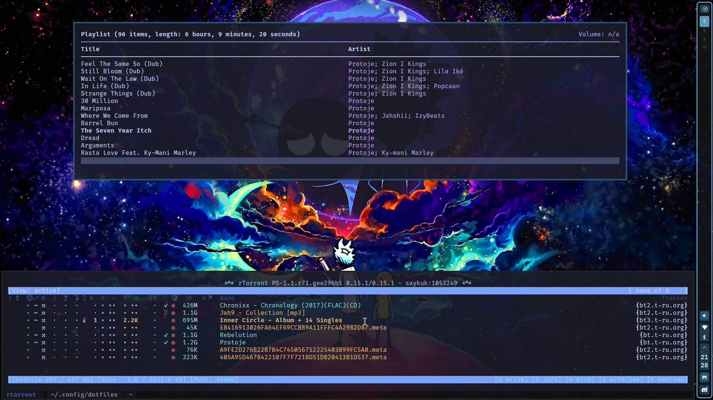
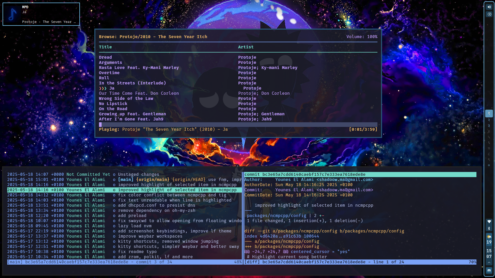
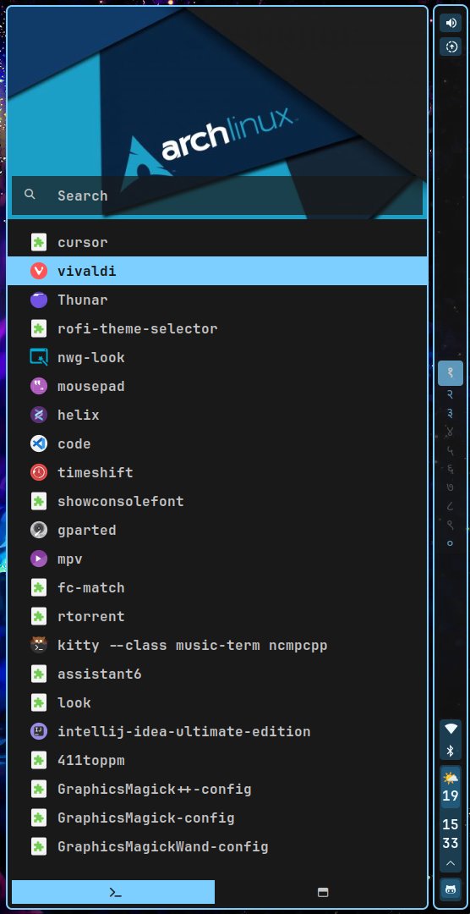

# Dotfiles

Personal dotfiles for **Arch Linux**, **Void Linux**, and **macOS** — Sway/Wayland desktop, Neovim, Zsh, and friends.

> This is a reference, not an installer. Read and understand before applying anything.

<div align="center">
  <table>
    <tr>
      <td align="center">
        
        <p>Dev Environment</p>
      </td>
      <td align="center">
        
        <p>Tig + Ncmpcpp</p>
      </td>
      <td align="center">
        
        <p>Rofi + Waybar</p>
      </td>
    </tr>
  </table>
</div>

## The `dot` CLI

All management goes through the `dot` CLI (TypeScript/Bun):

```sh
bun dot.ts <command>
```

### Commands

| Command               | Description                                     |
| --------------------- | ----------------------------------------------- |
| `dot link <pkg>`      | Symlink a package's files into place            |
| `dot unlink <pkg>`    | Remove those symlinks                           |
| `dot info <pkg>`      | Show metadata, files, and per-distro packages   |
| `dot configure <pkg>` | Run `configure.sh` for a package                |
| `dot enable <pkg>`    | Run the enable script (init-system-aware)       |
| `dot disable <pkg>`   | Run the disable script                          |
| `dot update system`   | Update xbps/pacman, flatpak, bun, deno, rustup  |
| `dot update global`   | Update npm/bun/pipx/cargo global packages       |
| `dot update source`   | Update cargo-installed tools, anyzig, ly, zinit |
| `dot update --info`   | Show installed versions                         |
| `dot assets sync`     | Sync fonts, icons, themes from GitHub releases  |
| `dot docs`            | Browse setup documentation                      |

### Linking flags

```sh
dot link zsh                     # home files only
dot link zram                    # auto-detects runit or systemd
dot link ly --init runit         # explicit init override
dot link --tag wayland           # link all wayland-tagged packages
dot link nvim --dry-run          # preview without changes
```

Init system (runit vs systemd) is auto-detected from the running PID 1. Pass `--init` to override.

## Package structure

Every directory in `packages/` is a package. No registration needed.

```
packages/<name>/
├── meta.json          # machine-readable metadata (optional)
├── README.md          # human notes (optional)
├── home/              # symlinked to ~/
│   └── .config/<app>/
├── system/
│   ├── base/          # symlinked to / (always)
│   ├── runit/         # symlinked to / (when --init runit)
│   └── systemd/       # symlinked to / (when --init systemd)
├── configure.sh       # run with `dot configure`
├── enable-runit.sh    # run with `dot enable --init runit`
├── enable-systemd.sh  # run with `dot enable --init systemd`
└── disable-*.sh
```

### meta.json

Packages can declare metadata in `meta.json`:

```json
{
  "description": "Neovim with LSP and Mason",
  "packages": {
    "arch": {
      "pacman": ["neovim", "tree-sitter"],
      "brew": ["python-pynvim", "ripgrep", "fd"]
    },
    "void": {
      "xbps": ["neovim", "python3-neovim", "tree-sitter", "ripgrep", "fd"]
    },
    "macos": { "brew": ["neovim", "ripgrep", "fd"] }
  },
  "tags": ["editor", "dev"],
  "cleanSteps": ["rm -rf ~/.local/share/nvim"],
  "os": ["linux", "macos"]
}
```

`dot info <pkg>` shows packages filtered to the current distro. `dot link --tag <tag>` links all matching packages at once.

## OS support

Shared `$HOME` is supported between Arch and Void (glibc). Node versions installed by fnm are ABI-compatible between both distros — install once, use on both.

The shell config auto-detects the distro at startup and exports `$_DISTRO` (`arch`, `void`, `macos`, `linux`) for use in all shell contexts.

## Clipboard

All clipboard operations go through `~/.local/bin/clipboard-copy` (linked via `dot link zsh`). It auto-selects `pbcopy` on macOS, `wl-copy` on Wayland, `xclip`/`xsel` on X11. Nothing is hardcoded.

## Node / fnm

fnm is installed natively via cargo on all Linux distros and via brew on macOS. FNM_DIR defaults to `~/.local/share/fnm` (or `~/.cache/managed-fnm` in managed mode). Since `$HOME` is shared between Arch and Void (both glibc), the same Node versions work on both.

```sh
# Install/update fnm
cargo install fnm

# Or via dot
dot update source
```

## Notes

- The `docs/` directory has setup notes for fonts, NVIDIA, grub, snapper, pipewire, and zram.
- For Void-specific setup see `VOID.md`.
