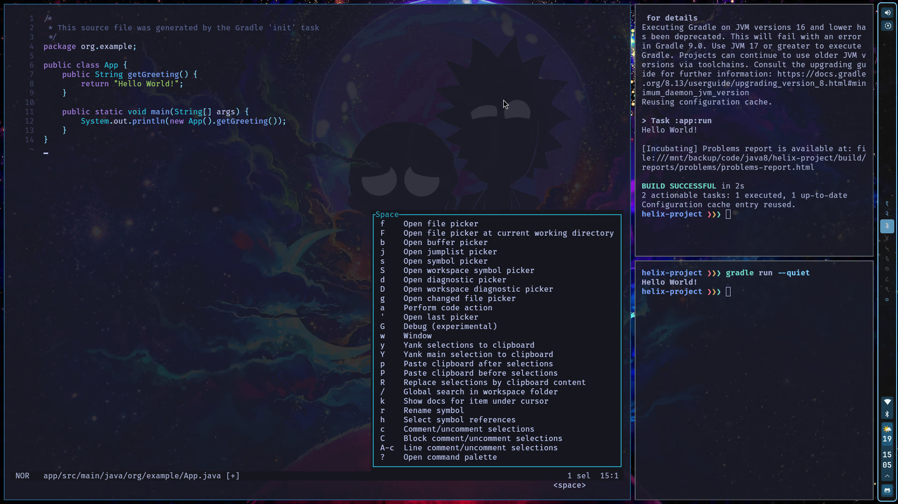

# Dotfiles

This repository contains my personal dotfiles for configuring Arch with Sway.

> **Important**: This is not an auto-configure script, but documentation. You are expected to read and understand what you're doing before applying any changes to your system.

## Screenshots

<div align="center">
  <table>
    <tr>
      <td align="center">
        
        <p>Dev Environment</p>
      </td>
      <td align="center">
        
        <p>Tig + Ncmpcpp</p>
      </td>
      <td align="center">
        
        <p>Rofi + Waybar</p>
      </td>
    </tr>
  </table>
</div>

## Workflow

The recommended workflow for using these dotfiles follows these steps:

### 1. Install

Start by installing required packages from the `install` folder.

### 2. Configure

After installation, configure your system using the files in the `packages` folder. Each package folder contains configuration for a specific application or system component.

### 3. Setup (Optional)

Some packages contain a `setup.sh` script that can help apply the configuration.

## Stow Helper

The `stow.sh` script is a helper function that will symlink configuration files to their target locations. And will run setup.sh if the package has one.
For granular control, you can comment out specific packages inside the script.

```bash
# My username "shad" is hardcoded in some config files.
# Provide yours and stow script will use it.
./stow.sh --username "Your user name"
```

## Notes
- Always back up your existing configurations before applying these dotfiles
- Search for "shad" to make sure to find places with my hardcoded username.
